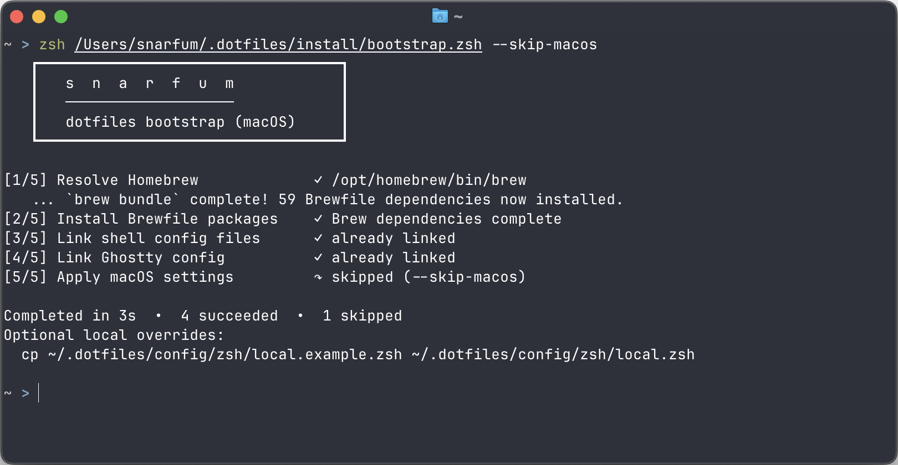

# Dotfiles



Personal dotfiles for reproducible shell and workstation setup, centered on macOS.

## Purpose

This repo bootstraps a machine with Homebrew packages, shell config, and a small set
of app configs while preserving existing user files via timestamped backups.

## Supported Platforms

- Primary: macOS 13+ (Ventura/Sonoma/Sequoia style setup with Homebrew).
- Secondary: Linux for raw config reuse only; `install/bootstrap.zsh` is macOS-only.

See [Platform Notes](docs/platforms.md) for details and prerequisites.

## Quick Install

```zsh
git clone <repo-url> ~/.dotfiles
zsh ~/.dotfiles/install/bootstrap.zsh
```

Common flags:

```zsh
zsh ~/.dotfiles/install/bootstrap.zsh --dry-run
zsh ~/.dotfiles/install/bootstrap.zsh --verbose
zsh ~/.dotfiles/install/bootstrap.zsh --skip-macos
```

## Safe Defaults

- Idempotent intent: reruns should be safe and mostly no-op when already configured.
- Before relinking `~/.zshrc` or `~/.zprofile`, existing files are moved to
  timestamped backups (`.bak.YYYYmmddHHMMSS`).
- `install/macos.zsh` is interactive and opt-out via `--skip-macos`.
- `fzf` defaults are wired to `rg` (`FZF_DEFAULT_COMMAND`, `FZF_CTRL_T_COMMAND`)
  for fast file discovery with hidden files included and `.git/` excluded.

## What Gets Managed

- Homebrew packages and casks from `brew/Brewfile` (includes `fzf` and `ripgrep`).
- Symlinks:
  - `~/.zshrc` -> `~/.dotfiles/config/zsh/.zshrc`
  - `~/.zprofile` -> `~/.dotfiles/config/zsh/.zprofile`
  - `$XDG_CONFIG_HOME/ghostty/config` -> `~/.dotfiles/config/ghostty/config`
- Optional interactive macOS defaults in `install/macos.zsh`.

## Rollback / Uninstall

1. Remove symlinks if present:
   - `rm ~/.zshrc ~/.zprofile`
   - `rm ${XDG_CONFIG_HOME:-$HOME/.config}/ghostty/config`
2. Restore backups created by bootstrap (`*.bak.<timestamp>`) as needed.
3. Optionally uninstall brew-managed packages with:
   - `brew bundle cleanup --file ~/.dotfiles/brew/Brewfile --force`
4. Remove repo clone:
   - `rm -rf ~/.dotfiles`

## Off-Limits and Invariants

- Scripts should not delete user files by default.
- No secret material (tokens/keys/passwords) should be committed.
- Network installs are limited to explicit bootstrap dependencies (Homebrew, git/curl).

See:

- [Architecture](docs/architecture.md)
- [Operations](docs/operations.md)
- [Contributing](CONTRIBUTING.md)
- [Security](SECURITY.md)
